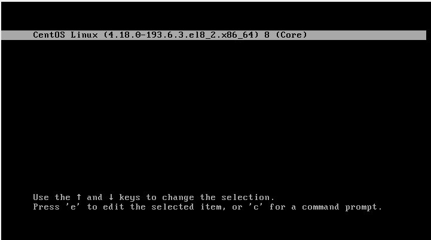
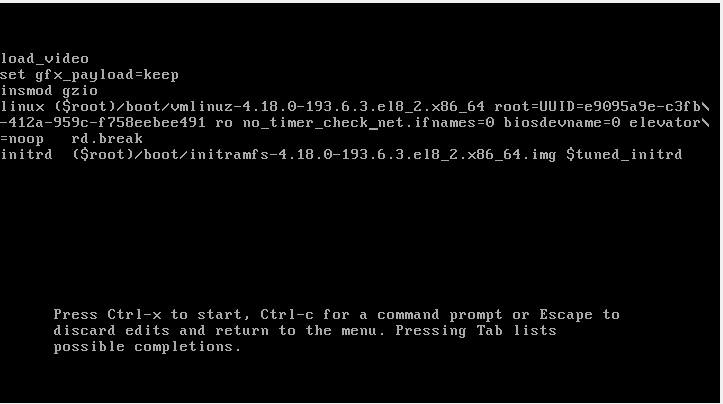
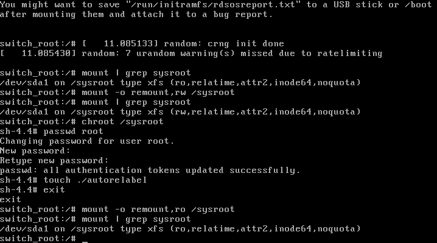
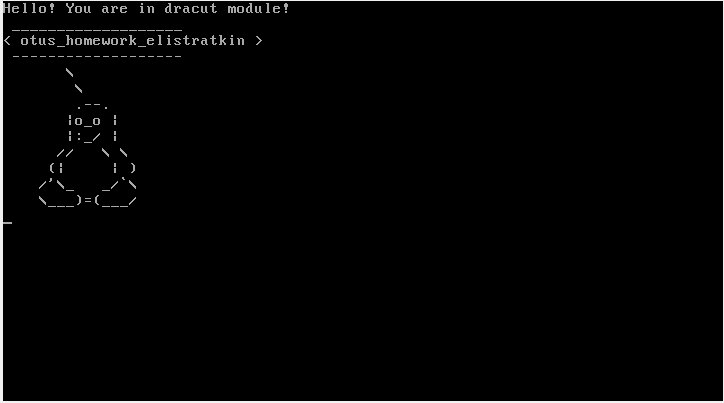

## Работа с загрузчиком

<li> Попасть в систему без пароля несколькими способами.</li>
<li> Установить систему с LVM, после чего переименовать VG.</li>
<li> Добавить модуль в initrd</li> 

**Решение:** 
В качестве стенда возьмем <a href="./Vagrantfile">vagrantfile</a> с одной вм на базе centos 7

**Попасть в систему без пароля несколькими способами.** 
1. В графическом режиме останавливаем загрузку системы на этапе выбора ядра 

2. Изменяем параметры загрузки, используя rd.break 

3. Перемонтируем каталог sysroot в режим rw, изменим root пароль, перемонтируем обратно в ro и продолжим загрузку 

4. После загрузки системы в качестве проверки авторизуемся под рутом с использованием нового пароля  

**Установить систему с LVM, после чего переименовать VG** 
В каталоге представлен <a href="./vg_rename.log">лог</a> работы по переименованию volume group. Работа состояла из команды переименования vgroup, изменение конфигурации fstab, grub и grub.cfg, а также пересоздания initrd image  

**Добавить модуль в initrd** 
В каталоге представлен <a href="./initrd.log">лог</a> работы по добавлению кастомного модуля в initrd. Работа состояла из добавления новых модулей в каталог, пересоздания initrd image и переконфигурирования grub.cfg (выполнено на предыдущем шаге) 
Результат на скриншоте ниже

