## Практика с SELinux

**1. Запустить nginx на нестандартном порту 3-мя разными способами:**
<li> переключатели setsebool;</li>
<li> добавление нестандартного порта в имеющийся тип;</li>
<li> формирование и установка модуля SELinux.</li> 
К сдаче: 
README с описанием каждого решения (скриншоты и демонстрация приветствуются).  

**2. Обеспечить работоспособность приложения при включенном selinux.**
<li> развернуть приложенный стенд https://github.com/mbfx/otus-linux-adm/tree/master/selinux_dns_problems</li> 
<li> выяснить причину неработоспособности механизма обновления зоны (см. README);</li>
<li> предложить решение (или решения) для данной проблемы;</li>
<li> выбрать одно из решений для реализации, предварительно обосновав выбор;</li>
<li> реализовать выбранное решение и продемонстрировать его работоспособность.</li> 
К сдаче: 
<li> README с анализом причины неработоспособности, возможными способами решения и обоснованием выбора одного из них;</li>
<li> исправленный стенд или демонстрация работоспособной системы скриншотами и описанием.</li>  

**Решение:**  
1. Запустить nginx на нестандартном порту 3-мя разными способами 
Запускаем vagrant стенд с уже настроенным провижином nginx на нестандартный порт 4881. После запуска стенда убедимся, что SELinux включен, а nginx отказался запускаться на нестандартном порту
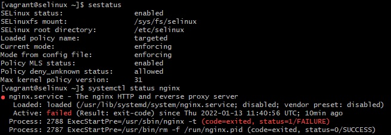 
<li> переключатели setsebool</li>
Для начала доустановим пакет <em>policycoreutils-python</em> и скормим ему audit лог. Приложение предлагает рекомендует нам воспользоваться переключателем setsebool.

 
Не будем спорить и воспользуемся им. После этого вновь попробуем запустить nginx

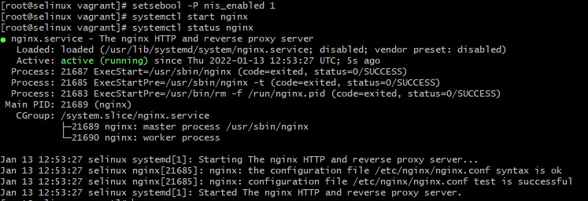 
Nginx жив, здоров. Откатываем изменения и идем дальше 

<li> Добавление нестандартного порта в имеющийся тип </li>
Проверяем, что наш nginx по-прежнему себя плохо чувствует

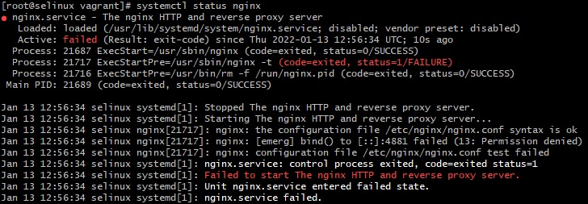 
Теперь пойдем по пути добавления нестандартного порта в список доступных для службы. Для этого вопспользуемся услуга semanage и проверим какие порты доступны на текущий момент

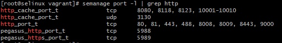 
Как мы видим портов всяких разных полно, но нашего 4881 нет и в помине. Добавим же его

 
Проверяем, что порт добавлен и пробуем запустить nginx.

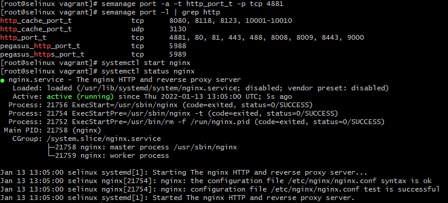 
Nginx жив, здоров. Откатываем изменения и идем дальше 

<li> формирование и установка модуля SELinux.</li>
Проверяем, что наш nginx по-прежнему себя плохо чувствует

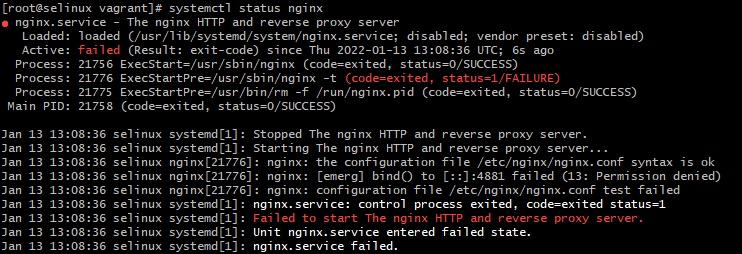 
Для формирования модуля SELinux воспользуемся утилитой audit2allow, скормив ему наш выдуржку аудит лога, относящуюся к nginx, и вежливо попросив собрать на его основании модуль с названием nginx

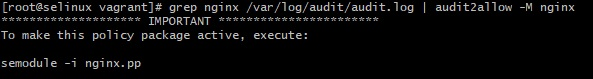 
Применим собранный модуль и проверим как на этот раз чувствует себя nginx

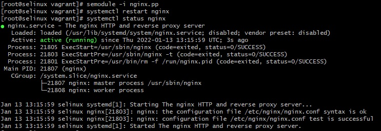 
Nginx жив, здоров. Три способа рассмотрены.  

2. Обеспечить работоспособность приложения при включенном selinux 
Запускаем проблемный vagrant стенд (настройка стенда осуществляется через , состоящий из DNS сервера ns01 и клиентской машины client. Воспроизведем действия инженера по внесению изменений в зону

 
Видим, что обновление заканчивается ошибкой. Перейдем к разбору проблем с SELinux. Посмотрим на audit логи клиентской машины

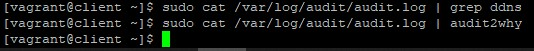 
И ничего не находим, чтобы относилось к нашей задаче по обновлению зоны. Пойдем с тем же вопрос на сам DNS сервер.

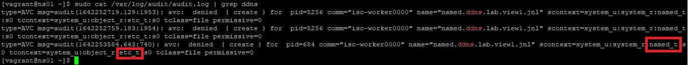 
И здесь мы уже можем наблюдать проблему. А именно несоответствие контекстов безопасности домена. Это говорит о том, что конфиги мы складываем в каталог, у которого по умолчанию не настроено для этого правило.
Посмотрим какие контексты безопасности у нас есть для /etc/named.

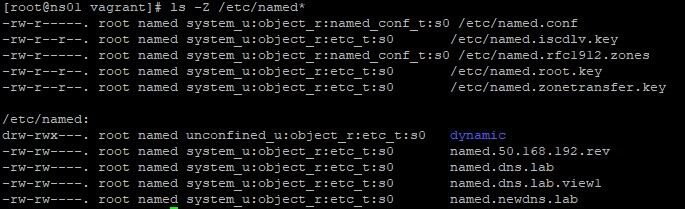 
 Как мы видим, все они имеют контекст etc_t вместо ожидаемых named_t.  
 В своем решении пойдем по пути изменения контекста безопасности, раз мы считаем, что файлы должны лежать там
 
 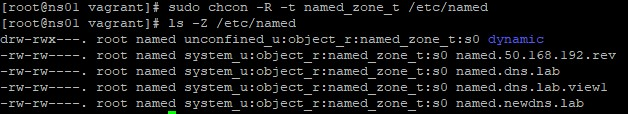 
 
 Пробуем еще раз обновить зону И проверим полученный результат
 
 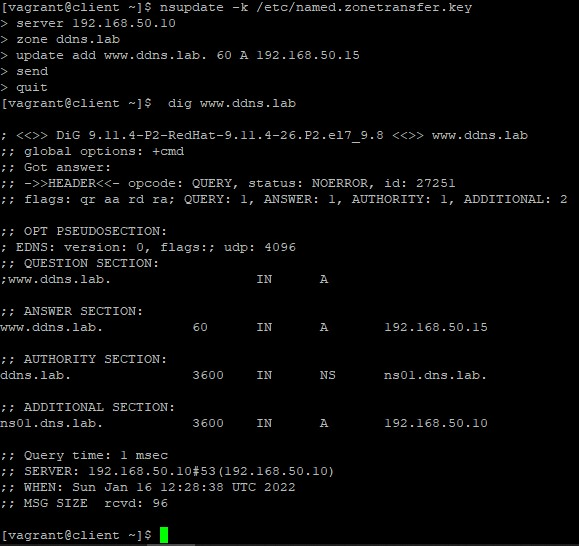 