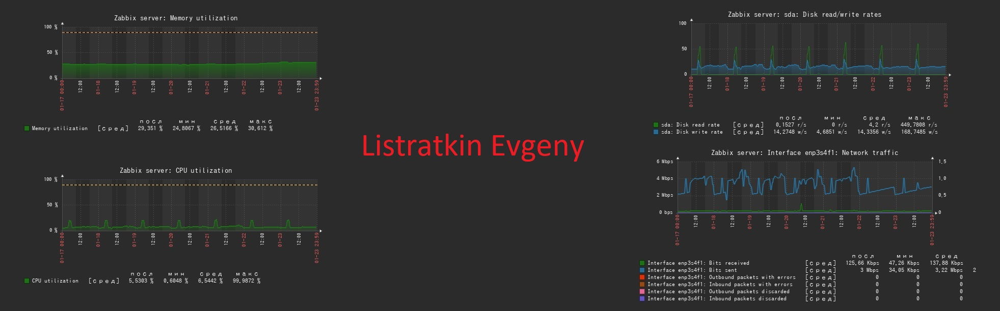
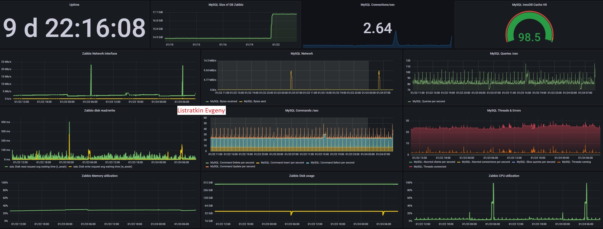

## Настройка мониторинга

**Настроить дашборд с 4-мя графиками**

<li>память;</li>
<li>процессор;</li>
<li>диск;</li>
<li>сеть.</li>  

Настроить на одной из систем: 
<li>zabbix (использовать screen (комплексный экран);</li>
<li>prometheus - grafana</li>  

**Решение:**  
В связке zabbix+grafana работаю уже давно, поэтому просто прикладываю имеющиеся экраны 
 
 
